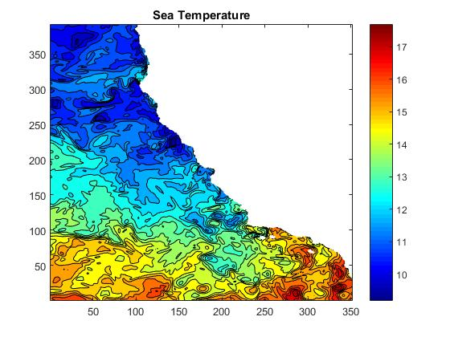
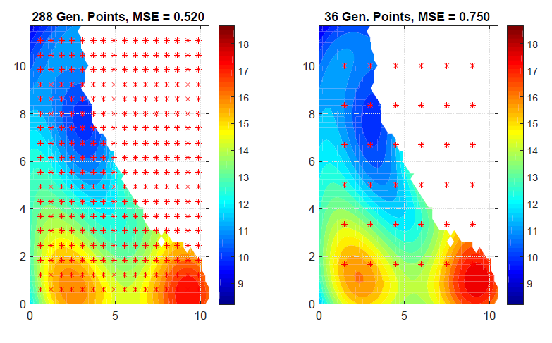

# Matlab Toolbox for GPs and GPs with built-in GMRF

The toolbox has beed designed during a project work at the Technical University Hamburg.
It includes algorithms for Gaussian Processes and Gaussian Processes with built-in Gausian Markov Random Fields.
A detailed description can be found at the Projektwork.pdf.


Temperature field created using data from the California Coastal Regional Ocean Modeling System (ROMS) model. The data extends
from just north of the CA-Oregon border south to Mexico and has a resolution of 0.03 degrees.


The left figure shows an estimation with the in average at most optimal number of generating points ordered in a grid. The right figure 
shows for comparison an estimation using 36 generating points.

## Usage
Take a look at the example.m file. There temperature data from the pacific ocean is used for an estimation example. 
In order to call spatial GP with built-in GMRF we use
```
[mu,Sigma] = GMRF_Spatial(p,x,s,y);
```
and can specialize the call by adding different options such as noise, method, etc. Other functions are the Gaussian Processes or the sequential GPs with built-in GMRF called by
```
[mu,Sigma,time] = GP(x,s,y);
[mu,Sigma,Q_dach,y_dach] = GMRF_Sequential(Q_dach,y_dach,p,x,s,y);
```
For further information see description at the beginning of each function.

## Add Covariance Matrix and Precision Matrix Definitions
In the folders covariance_functions and precision_functions you find the methods which generate the respective matrices. In order to add new methods, take a look at the example scripts cov_example.m and pre_example.m.
